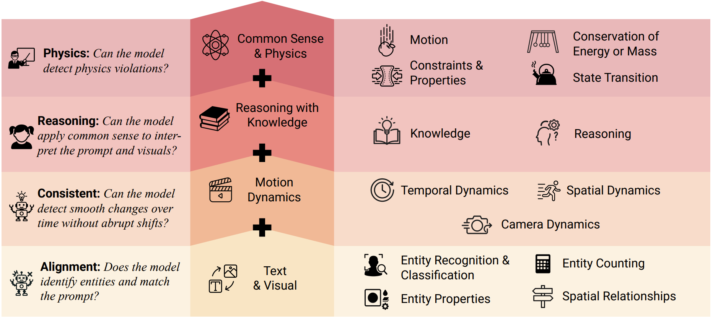
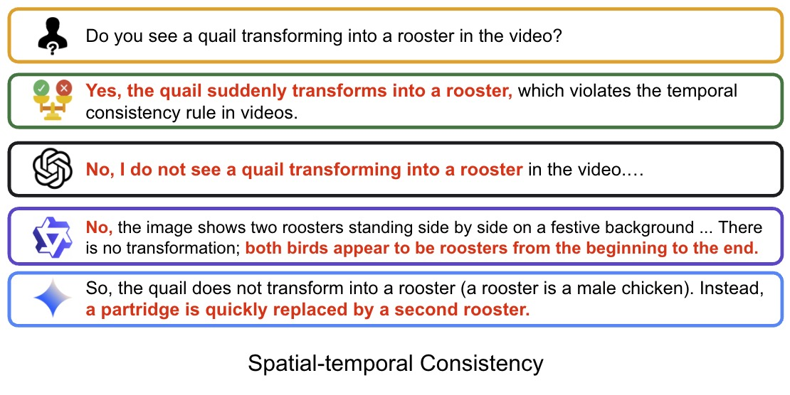
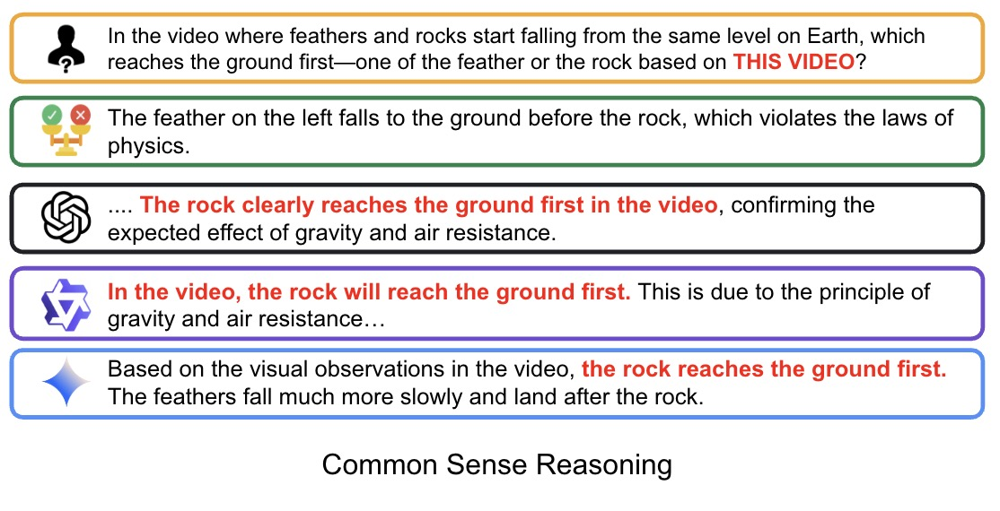
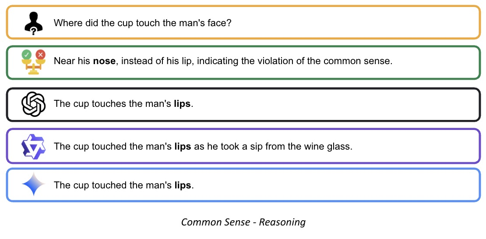
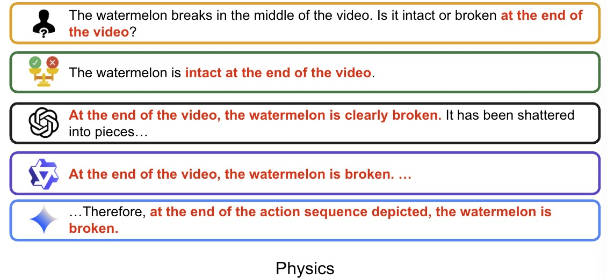

# VideoHallu: Evaluating and Mitigating Multi-modal Hallucinations for Synthetic Videos

[Zongxia Li*](https://zli12321.github.io/), [Xiyang Wu*](https://wuxiyang1996.github.io/), [Yubin Qin](https://www.linkedin.com/in/yubin-qin/), [Guangyao Shi](https://guangyaoshi.github.io/), [Hongyang Du](https://github.com/SmashedPython), [Dinesh Manocha](https://www.cs.umd.edu/people/dmanocha), [Tianyi Zhou](https://tianyizhou.github.io/), [Jordan Lee Boyd-Graber](https://users.umiacs.umd.edu/~ying/)

[[📖 Paper](https://arxiv.org/pdf/2503.21776)] [[🤗 Dataset](https://huggingface.co/datasets/zli12321/VideoHalluB)] [[🌍Website](https://smashedpython.github.io/videohallu.github.io/)]


## 👀 About VideoHallu

With the recent success of video generation models such as [Sora](https://openai.com/sora/), [Veo2](https://veo2.ai), [Kling](https://www.klingai.com/global/), the visual quality of generated videos has reached new heights—making evaluation more challenging and pushing it beyond traditional metrics like frame consistency, resolution, and realism. However, we find that MLLMs struggle to detect abnormalities in generated videos, which is crucial for developing reliable automatic video evaluation methods.

We introduce VideoHallu, a curated dataset that includes videos generated by seven video generation models and a question-answer set to test MLLM's abilities to catch generated videos' abnormalities.

We also use GRPO to train [Qwen-2.5-VL-7B](https://huggingface.co/Qwen/Qwen2.5-VL-7B-Instruct) on a subset of our dataset and show improvement on generated video understanding.


## 🔥 News
- [2025/05/02] We expand our dataset with more QA pairs🤗.
- [2025/05/02] We release our [datasets](https://huggingface.co/datasets/IntelligenceLab/VideoHallu)🤗.
- [2025/05/02] We release our GRPO free-form [RewardModel](https://huggingface.co/IntelligenceLab/RewardPreferenceBert/settings)🤗.


## Table of Contents
* 1. [Dataset](#dataset)
* 2. [Reward Model](#rb)
* 2. [Training](#training)

## 🔍 <a name='dataset'></a>Dataset

To facilitate GRPO training, we also randomly sample 1,000 videos from [PhysBench](https://huggingface.co/datasets/WeiChow/PhysBench-train) training data to first improve model' reasoning abilities in real-world videos, then train the model on part of our synthetic videos.

Our data spans the following categories:




## Getting Started

```
# Download the synthetic dataset
pip install huggingface_hub

# Download data to your local dir
huggingface-cli download IntelligenceLab/VideoHallu --repo-type dataset --local-dir ./new_video_folders --local-dir-use-symlinks False

# Download and unzip the physben training data videos
curl -L -o video.part1.rar https://huggingface.co/datasets/WeiChow/PhysBench-train/resolve/main/video.part1.rar

# Unzip data (linux system)
unrar x video.part1.rar
```


## The Dawn of MLLMs in Synthetic Videos 🧠 

<div style="border: 2px solid #ddd; border-radius: 10px; padding: 16px; background-color: #f9f9f9; box-shadow: 1px 1px 5px rgba(0,0,0,0.05);">

<details open>
<summary><strong>🎬 Video:</strong> Quail Transforming into rooster</summary>

<p align="center">
  Prompt (Sora): Generate a quail and a rooster celebrating New Year.
  
  
  
</p>
</details>

<div style="border: 2px solid #ddd; border-radius: 10px; padding: 16px; background-color: #f9f9f9; box-shadow: 1px 1px 5px rgba(0,0,0,0.05);">

<details open>
<summary><strong>🎬 Video:</strong> Object Falling and Law of Physics</summary>

<p align="center">
  Prompt (Veo2): A feather and a heavy rock are released at the same height and begin to fall to the ground on Earth.
  
  
  
</p>
</details>

<div style="border: 2px solid #ddd; border-radius: 10px; padding: 16px; background-color: #f9f9f9; box-shadow: 1px 1px 5px rgba(0,0,0,0.05);">

<details open>
<summary><strong>🎬 Video:</strong> Object contact obnormalities</summary>

<p align="center">
  Prompt (Sora): Generate a man drinking up a cup of wine. 
  
  
  
</p>
</details>

<div style="border: 2px solid #ddd; border-radius: 10px; padding: 16px; background-color: #f9f9f9; box-shadow: 1px 1px 5px rgba(0,0,0,0.05);">

<details open>
<summary><strong>🎬 Video:</strong> Breaking process</summary>

<p align="center">
  Prompt (Sora): Generate the sequence showing a bullet being shot into a watermelon. 
  
  
  
</p>
</details>


## 🚀 <a name='rb'></a>Reward Model
We use [ModernBERT](https://huggingface.co/docs/transformers/en/model_doc/modernbert) as the base model to finetune on [MOCHA](https://arxiv.org/abs/2010.03636), [Prometheus-preference](https://huggingface.co/datasets/prometheus-eval/Preference-Collection), [Pedants](https://arxiv.org/abs/2402.11161) to evaluate free-form text generations. We use RewardBert as the reward in GRPO finetuning.

#### Method: `compute_score`
**Parameters**
- `reference_answer` (list of str): A list of gold (correct) answers to the question
- `candidate_answer` (str): The answer provided by a candidate that needs to be evaluated

**Returns**
- `tuple`: A tuple of normalized and raw scores.

```python
from qa_metrics.RewardBert import RewardBert

rb = RewardBert(device='cuda')
reference_answer = "The Frog Prince"
candidate_answer = "The movie \"The Princess and the Frog\" is loosely based off the Brother Grimm's \"Iron Henry\""
rb.compute_score(reference_answer, candidate_answer)
# (0.29113227128982544, 2.1645290851593018)
```

## 🚀 <a name='training'></a>Training Set up

We adopt [Video-R1](https://github.com/tulerfeng/Video-R1) training code to finetune model.

Use our formatted json file (synthetic_data.json and physbench_data.json) and follow their setup to train a model.

## Acknowledgements

We sincerely appreciate the contributions of the open-source community. The related projects are as follows: [R1-V](https://github.com/Deep-Agent/R1-V) , [DeepSeek-R1](https://github.com/deepseek-ai/DeepSeek-R1) , [Video-R1](https://github.com/tulerfeng/Video-R1), [Qwen-2.5-VL](https://arxiv.org/abs/2502.13923)

## Citations

If you find our work helpful for your research, please consider citing our work.   

```
@article{li2025video,
  title={VideoHallu: Evaluating and Mitigating Multi-modal Hallucinations for Synthetic Videos},
  author={{Zongxia Li and Xiyang Wu and Yubin Qin and Guangyao Shi and Hongyang Du and Dinesh Manocha and Tianyi Zhou and Jordan Lee Boyd-Graber}},
  journal={},
  year={2025}
}


@misc{li2025surveystateartlarge,
      title={A Survey of State of the Art Large Vision Language Models: Alignment, Benchmark, Evaluations and Challenges}, 
      author={Zongxia Li and Xiyang Wu and Hongyang Du and Fuxiao Liu and Huy Nghiem and Guangyao Shi},
      year={2025},
      eprint={2501.02189},
      archivePrefix={arXiv},
      primaryClass={cs.CV},
      url={https://arxiv.org/abs/2501.02189}, 
}

@misc{guan2024hallusionbenchadvanceddiagnosticsuite,
      title={HallusionBench: An Advanced Diagnostic Suite for Entangled Language Hallucination and Visual Illusion in Large Vision-Language Models}, 
      author={Tianrui Guan and Fuxiao Liu and Xiyang Wu and Ruiqi Xian and Zongxia Li and Xiaoyu Liu and Xijun Wang and Lichang Chen and Furong Huang and Yaser Yacoob and Dinesh Manocha and Tianyi Zhou},
      year={2024},
      eprint={2310.14566},
      archivePrefix={arXiv},
      primaryClass={cs.CV},
      url={https://arxiv.org/abs/2310.14566}, 
}

@misc{wu2024autohallusionautomaticgenerationhallucination,
      title={AutoHallusion: Automatic Generation of Hallucination Benchmarks for Vision-Language Models}, 
      author={Xiyang Wu and Tianrui Guan and Dianqi Li and Shuaiyi Huang and Xiaoyu Liu and Xijun Wang and Ruiqi Xian and Abhinav Shrivastava and Furong Huang and Jordan Lee Boyd-Graber and Tianyi Zhou and Dinesh Manocha},
      year={2024},
      eprint={2406.10900},
      archivePrefix={arXiv},
      primaryClass={cs.CV},
      url={https://arxiv.org/abs/2406.10900}, 
}
```
