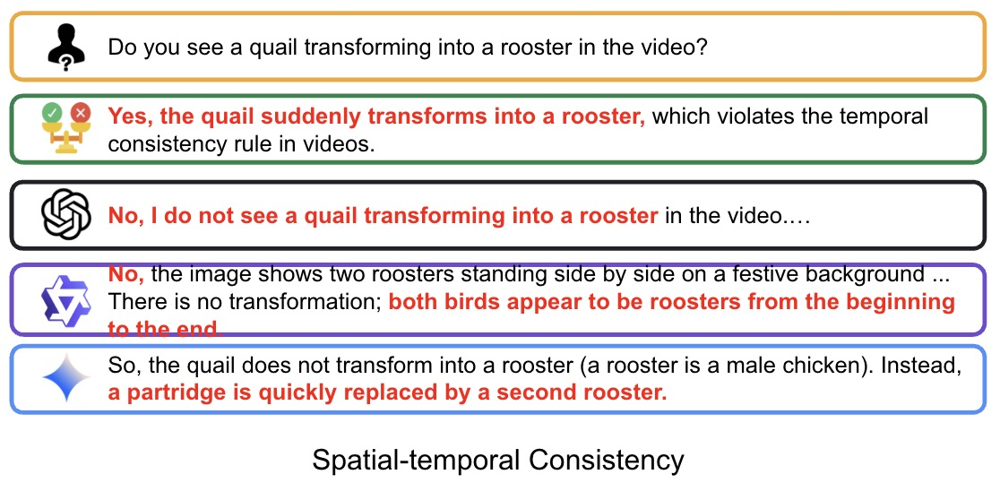
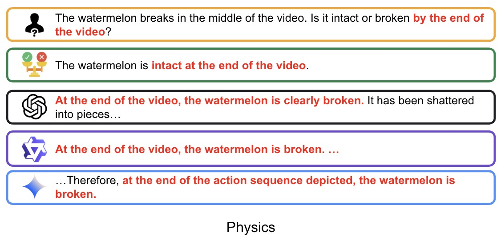

# VideoHallu: Evaluating and Mitigating Multi-modal Hallucinations for Synthetic Videos

[Zongxia Li*](https://zli12321.github.io/), [Xiyang Wu*](https://wuxiyang1996.github.io/), [Yubin Qin](https://www.linkedin.com/in/yubin-qin/), [Guangyao Shi](https://guangyaoshi.github.io/), [Hongyang Du](https://www.linkedin.com/in/hongyangdu/), [Dinesh Manocha](https://www.cs.umd.edu/people/dmanocha), [Tianyi Zhou](https://tianyizhou.github.io/), [Jordan Lee Boyd-Graber](https://users.umiacs.umd.edu/~ying/)

[[📖 Paper](https://arxiv.org/pdf/2503.21776)] [[🤗 Dataset](https://huggingface.co/Video-R1/Video-R1-7B)]


## 👀 About VideoHallu

With the recent success of video generation models such as [Sora](https://openai.com/sora/), [Veo2](https://veo2.ai), [Kling](https://www.klingai.com/global/), the visual quality of generated videos has reached new heights—making evaluation more challenging and pushing it beyond traditional metrics like frame consistency, resolution, and realism. However, we find that MLLMs struggle to detect abnormalities in generated videos, which is crucial for developing reliable automatic video evaluation methods.

We introduce VideoHallu, a curated dataset that includes videos generated by seven video generation models and a question-answer set to test MLLM's abilities to catch generated videos' abnormalities.

We also use GRPO to train [Qwen-2.5-VL-7B](https://huggingface.co/Qwen/Qwen2.5-VL-7B-Instruct) on a subset of our dataset and show improvement on generated video understanding.


## 🔥 News
- [2025/05/02] We release our datasets in huggingface🤗.

## 🔍 Dataset

To facilitate GRPO training, we also randomly sample 1,000 videos from [PhysBench](https://huggingface.co/datasets/WeiChow/PhysBench-train) training data to first improve model' reasoning abilities in real-world videos, then train the model on part of our synthetic videos.

Our data spans the following categories:


## Getting Started

```
# Download the dataset
pip install huggingface_hub

# Download data to your local dir
huggingface-cli download zli12321/VideoHallu --repo-type dataset --local-dir ./new_video_folders --local-dir-use-symlinks False
```


## The Dawn of MLLMs in Synthetic Videos 🧠 

<div style="border: 2px solid #ddd; border-radius: 10px; padding: 16px; background-color: #f9f9f9; box-shadow: 1px 1px 5px rgba(0,0,0,0.05);">

<details open>
<summary><strong>🎬 Video:</strong> Quail Transforming into rooster</summary>

<p align="center">
  Prompt (Sora): Generate a quail and a rooster celebrating New Year.
  
  
  
</p>
</details>

<div style="border: 2px solid #ddd; border-radius: 10px; padding: 16px; background-color: #f9f9f9; box-shadow: 1px 1px 5px rgba(0,0,0,0.05);">

<details open>
<summary><strong>🎬 Video:</strong> Object Falling and Law of Physics</summary>

<p align="center">
  Prompt (Veo2): A feather and a heavy rock are released at the same height and begin to fall to the ground on Earth.
  
  
  
</p>
</details>

<div style="border: 2px solid #ddd; border-radius: 10px; padding: 16px; background-color: #f9f9f9; box-shadow: 1px 1px 5px rgba(0,0,0,0.05);">

<details open>
<summary><strong>🎬 Video:</strong> Object contact obnormalities</summary>

<p align="center">
  Prompt (Sora): Generate a man drinking up a cup of wine. 
  
  
  
</p>
</details>

<div style="border: 2px solid #ddd; border-radius: 10px; padding: 16px; background-color: #f9f9f9; box-shadow: 1px 1px 5px rgba(0,0,0,0.05);">

<details open>
<summary><strong>🎬 Video:</strong> Breaking process</summary>

<p align="center">
  Prompt (Sora): Generate the sequence showing a bullet being shot into a watermelon. 
  
  
  
</p>
</details>


## 🚀 Training Set up

We adopt [Video-R1](https://github.com/tulerfeng/Video-R1) training code to finetune model.

```bash
git clone https://github.com/tulerfeng/Video-R1
cd Video-R1

# build environment
conda create -n video-r1 python=3.11 
conda activate video-r1
bash setup.sh

# qwen video extraction setting, e.g., max frames, resolutions
# Use the [decord] feature to improve speed
cd src/qwen-vl-utils
pip install -e .[decord]
cd ..

# download training dataset
git lfs install
git clone https://huggingface.co/datasets/Video-R1/Video-R1-data
```

Please put the downloaded dataset to `src/r1-v/Video-R1-data/`

Then, unzip the data

```
python ./src/unzip.py
```

The `Video-R1-260k.json` file is for RL training while `Video-R1-COT-165k.json` is for SFT cold start.

Qwen2.5-VL has been frequently updated in the Transformers library, which may cause version-related bugs or inconsistencies. Our code is compatible with the following version, please download at [here](https://drive.google.com/file/d/1Kc81WZitEhUZYWXpL6y2GXuSXufLSYcF/view?usp=sharing)

Then install our provided version of transformers

```bash
unzip transformers-main.zip
cd ./transformers-main
pip install .
```

For vLLM library, please use 0.7.2 version.

For trl library, please use 0.16.0 version.

## 🚀 Training

We first perform supervised fine-tuning on the Video-R1-COT-165k dataset for one epoch to obtain the Qwen2.5-VL-7B-SFT model. If you want to perform CoT annotation on your own data, please refer to `src/generate_cot_vllm.py`

```bash
bash ./src/scripts/run_sft_video.sh
```
If you want to skip the SFT process, we also provide one of our SFT models at [🤗Qwen2.5-VL-SFT](https://huggingface.co/Video-R1/Qwen2.5-VL-7B-COT-SFT). 

This is followed by RL training on the Video-R1-260k dataset to produce the final Video-R1 model. Due to current computational resource limitations, we train the model for only 1.2k RL steps.  

The script for training the obtained Qwen2.5-VL-7B-SFT model with T-GRPO or GRPO is as follows

```bash
bash ./src/scripts/run_grpo_video.sh
```

You can also use the following script to enable vLLM acceleration for RL training

```bash
bash ./src/scripts/run_grpo_vllm_qwen25vl.sh
```

For efficiency considerations, we limit the maximum number of video frames to 16 during training. Each frame is processed at a max resolution of 128 × 28 × 28.  You can set this in `src/qwen-vl-utils`

Please keep per_device_train_batch_size=1 as in previous work r1-v

## 🔮 Inference & Evaluation

During inference, we increase the max frame resolution to 256 × 28 × 28 and max frames to 16/32/64 to enhance performance. You can easily set this in `src/qwen-vl-utils`

For all evaluations, we follow the decoding configuration used in the official Qwen2.5-VL demo, with top\_p = 0.001 and temperature = 0.01. Setting large top_p may encounter messy output when inference.

We recommend using our provided json files and scripts for easier evaluation. 

The json files can be downloaded at: [[🤗 Video-R1-eval](https://huggingface.co/datasets/Video-R1/Video-R1-eval)], put them in `/src/r1-v/Evaluation` 

Next, download the evaluation video data from each benchmark’s official website, and place them in `/src/r1-v/Evaluation` as specified in the provided json files.

Finally, conduct evaluation on all benchmarks using the following scripts

```bash
bash ./src/eval_bench.sh
```


## Acknowledgements

We sincerely appreciate the contributions of the open-source community. The related projects are as follows: [R1-V](https://github.com/Deep-Agent/R1-V) , [DeepSeek-R1](https://github.com/deepseek-ai/DeepSeek-R1) , [Video-R1](https://github.com/tulerfeng/Video-R1), [Qwen-2.5-VL](https://arxiv.org/abs/2502.13923)

## Citations

If you find our work helpful for your research, please consider citing our work.   

```
@article{feng2025video,
  title={Video-R1: Reinforcing Video Reasoning in MLLMs},
  author={Feng, Kaituo and Gong, Kaixiong and Li, Bohao and Guo, Zonghao and Wang, Yibing and Peng, Tianshuo and Wang, Benyou and Yue, Xiangyu},
  journal={arXiv preprint arXiv:2503.21776},
  year={2025}
}
```
