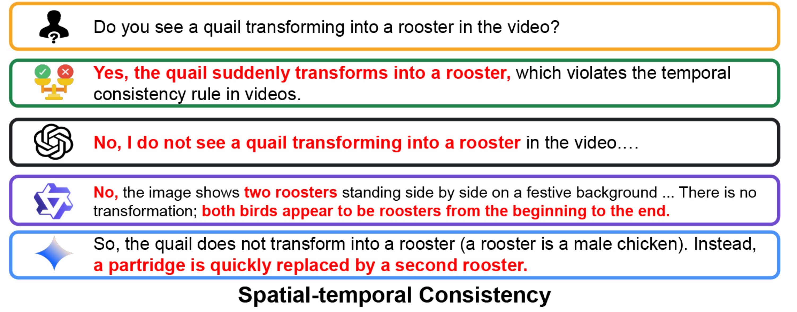

# VideoHallu: Evaluating and Mitigating Multi-modal Hallucinations for Synthetic Videos

[Zongxia Li*](https://zli12321.github.io/), [Xiyang Wu*](https://wuxiyang1996.github.io/), [Yubin Qin](https://www.linkedin.com/in/yubin-qin/), [Hongyang Du](https://smashedpython.github.io/HongyangDu.github.io/), [Guangyao Shi](https://guangyaoshi.github.io/), [Dinesh Manocha](https://www.cs.umd.edu/people/dmanocha), [Tianyi Zhou](https://tianyizhou.github.io/), [Jordan Lee Boyd-Graber](https://users.umiacs.umd.edu/~ying/)

[[📖 Paper](https://arxiv.org/abs/2505.01481)] [[🤗 Dataset](https://huggingface.co/datasets/zli12321/VideoHallu)] [[🌍Website](https://wuxiyang1996.github.io/videohallu_page/)]


## 👀 About VideoHallu

Synthetic video generation using foundation models has gained significant attention due to its realism and broad applications. However, while these models excel at generating visually coherent and high-quality video frames, they often overlook commonsense reasoning and physical law violations, leading to abnormal content. Existing score-based evaluations like [VideoScore](https://arxiv.org/abs/2406.15252) mainly focus on general video quality and do not take these abnormalities into account, and offer no explanations of the evaluation results. A more promising evaluation approach is to leverage multi-modal large language models (MLLMs) as interpretable video evaluators, following the approach of [FActScore](https://arxiv.org/abs/2305.14251). However, how well MLLMs can detect these abnormalities in synthetic videos is underexplored. 

Motivated by a more interpretable video generation evaluation, we introduce VideoHallu, a benchmark built from synthetic videos produced by popular models like [Sora](https://openai.com/sora/), [Veo2](https://veo2.ai), [Kling](https://www.klingai.com/global/), paired with expert-crafted question-answering pair examples easily solvable with human-level perception and reasoning across multiple categories. We evaluate several State-of-the-Art (SoTA) MLLMs with our benchmark, including [GPT-4o](https://openai.com/index/hello-gpt-4o/), [Gemini-2.5-Pro](https://deepmind.google/technologies/gemini/pro/), [Qwen-2.5-VL](https://github.com/QwenLM/Qwen2.5-VL), and forefront models like [Video-R1](https://github.com/tulerfeng/Video-R1) and [VideoChat-R1](https://github.com/OpenGVLab/VideoChat-R1). Despite the strong performance of R1 MLLMs on real-world video benchmarks like [MVBench](https://huggingface.co/datasets/OpenGVLab/MVBench) and [MovieChat](https://github.com/rese1f/MovieChat), these models still struggle and hallucinate on basic commonsense and physics reasoning tasks in synthetic videos, highlighting synthetic video hallucination as an underexplored challenge. 

Moreover, we post-train current SoTA MLLMs, [Qwen-2.5-VL-7B](https://huggingface.co/Qwen/Qwen2.5-VL-7B-Instruct), with [Group Relative Policy Optimization (GRPO)](https://arxiv.org/abs/2501.12948) using both real-world and synthetic commonsense/physics datasets. Our results show improved overall accuracy compared to the base model, achieving the highest performance among all models, highlighting the importance of integrating high-quality counterexamples to enhance commonsense and physics reasoning in MLLMs' language priors.

## 🔥 News
- [2025/05/02] We expand our dataset with more QA pairs🤗.
- [2025/05/02] We release our [datasets](https://huggingface.co/datasets/IntelligenceLab/VideoHallu)🤗.
- [2025/05/02] We release our GRPO free-form [RewardModel](https://huggingface.co/IntelligenceLab/RewardPreferenceBert/settings)🤗.


## Table of Contents
* [Benchmark](#benchmark)
* [Getting Started](#setup)
* [The Dawn of MLLMs in Synthetic Videos](#showcase)
* [Evaluation over SoTA MLLMs](#evaluation)
* [Reward Model](#rb)
* [Training](#training)
* [Fine-tuning Results](#evaluation_ft)
* [Acknowledgements](#ak)
* [Citations](#citations)

## 🔍 <a name='benchmark'></a>Benchmark

We design our benchmark, VideoHallu, around four question categories aimed at probing hallucinations in synthetic video understanding, organized by the level of reasoning required from MLLMs to perform video-question answering in practice. The benchmark spans from perceptual understanding to high-level abstract reasoning.
* **Alignment** checks if the model correctly identifies and understands entities using visual and textual cues. 
* **Spatial-temporal Consistency** examines whether the model can track entity motion across frames.
* **Common Sense Reasoning** tests if the model can reason based on its knowledge.
* **Physics** assesses if the model applies physical laws to entity motions and procedural understanding.

Each question in a category may also be assigned to multiple sub-categories, depending on the specific aspects it targets. Detailed annotations and sub-category breakdowns are available [here](https://huggingface.co/datasets/zli12321/VideoHalluB):

| Updated on  |            HuggingFace                         | Dataset Size |
|-------------|:------------------------------------------------:|:------------:|
| May, 2, 2025 | [HuggingFace](https://huggingface.co/datasets/zli12321/VideoHalluB) |     3233    |

Below is an overview of our benchmark’s organization, including the high-level question categories, ranked by the level of reasoning required by MLLMs, and their corresponding sub-category breakdowns.


## 📖 <a name='setup'></a>Getting Started

To set up our benchmark, please follow the steps provided below:

```
# Download the synthetic dataset
pip install huggingface_hub

# Download data to your local dir
huggingface-cli download IntelligenceLab/VideoHallu --repo-type dataset --local-dir ./new_video_folders --local-dir-use-symlinks False

# Download and unzip the physben training data videos
curl -L -o video.part1.rar https://huggingface.co/datasets/WeiChow/PhysBench-train/resolve/main/video.part1.rar

# Unzip data (linux system)
unrar x video.part1.rar
```


## <a name='showcase'></a>🧠 The Dawn of MLLMs in Synthetic Videos 

We present selected cases from SoTA MLLM evaluations across each category. Hallucinations in model answers, common sense or physics violations in videos, and other notable cues in the video, questions, or ground truth are highlighted to assist the reader's understanding. More examples can be found in the Appendix of [our paper](https://arxiv.org/abs/2505.01481).

**Note:** The legend below explains all the symbols used to represent the State-of-the-Art (SoTA) MLLMs featured in our showcases for synthetic video generation and video question-answering.
<p align="center">
  
</p>

### Alignment
**🗣️ Video Generation Prompt:** A young male athlete is playing basketball on an outdoor court, performing impressive dribbling and slam dunks.

**🎬 Synthetic Video:** 

<p align="center">
  
</p>

**🤖 Video Question-Answering by MLLMs:** 
<p align="center">
  
</p>

### Spatial-temporal Consistency
**🗣️ Video Generation Prompt:** Generate a quail and a rooster celebrating New Year.

**🎬 Synthetic Video:** 
<p align="center">
  
</p>

**🤖 Video Question-Answering by MLLMs:** 
<p align="center">
  
</p>

### Common Sense Reasoning
**🗣️ Video Generation Prompt:** A feather and a heavy rock are released at the same height and begin to fall to the ground on Earth.

**🎬 Synthetic Video:** 
<p align="center">
  
</p>

**🤖 Video Question-Answering by MLLMs:** 

<p align="center">
  
</p>

### Physics
**🗣️ Video Generation Prompt:** Generate the sequence showing a bullet being shot into a watermelon.

**🎬 Synthetic Video:** 
<p align="center">
  
</p>

**🤖 Video Question-Answering by MLLMs:** 
<p align="center">
  
</p>

## <a name='evaluation'></a>📊 Evaluation over SoTA MLLMs
We evaluate diverse SoTA models across sizes and training strategies, reporting both overall and sub-category accuracies. Qwen2.5-VL-32B achieves the highest overall performance among all models.
<p align="center">
  
</p>

We evaluate SoTA MLLMs on VideoHallu, with results broken down by sub-category. From left to right, we show: (a) models under 7B parameters; (b) models between 7B–38B; (c) R1 fine-tuned models; and (d) large black-box MLLMs. While many perform well on alignment tasks, they remain prone to hallucinations in reasoning-heavy tasks, with notably weaker performance on physics and commonsense reasoning.
<p align="center">
  
</p>

## 🏅 <a name='rb'></a>Reward Model
We use [ModernBERT](https://huggingface.co/docs/transformers/en/model_doc/modernbert) as the base model to finetune on [MOCHA](https://arxiv.org/abs/2010.03636), [Prometheus-preference](https://huggingface.co/datasets/prometheus-eval/Preference-Collection), [Pedants](https://arxiv.org/abs/2402.11161) to evaluate free-form text generations. We use RewardBert as the reward in GRPO finetuning.

#### Method: `compute_score`
**Parameters**
- `reference_answer` (list of str): A list of gold (correct) answers to the question
- `candidate_answer` (str): The answer provided by a candidate that needs to be evaluated

**Returns**
- `tuple`: A tuple of normalized and raw scores.

```python
from qa_metrics.RewardBert import RewardBert

rb = RewardBert(device='cuda')
reference_answer = "The Frog Prince"
candidate_answer = "The movie \"The Princess and the Frog\" is loosely based off the Brother Grimm's \"Iron Henry\""
rb.compute_score(reference_answer, candidate_answer)
# (0.29113227128982544, 2.1645290851593018)
```

## 🚀 <a name='training'></a>Training Set up

We adopt [Video-R1](https://github.com/tulerfeng/Video-R1) training code to fine-tune the model.

Use our formatted JSON files ([synthetic_data_split.json](https://github.com/zli12321/VideoHallu/blob/main/Data/synthetic_data_split.json) and [physbench_train_split.json](https://github.com/zli12321/VideoHallu/blob/main/Data/physbench_train_split.json)) and follow their setup to train a model.

## 📊 <a name='evaluation_ft'></a>Fine-tuning Results
We evaluate models fine-tuned on either domain-specific sub-datasets or curriculum-based composite datasets. Results show that models trained only on general real-world videos yield little to no gains on synthetic video understanding. Incorporating general physics data improves physics reasoning, and a curriculum starting with real-world physics followed by synthetic data leads to a 2.8% performance boost.
<p align="center">
  
</p>

We show results for (a) previous SoTA MLLMs, (b) models fine-tuned on sub-datasets, and (c) models fine-tuned on the full dataset via curriculum learning. Compared to the baseline (Qwen2.5-VL-7B), reinforcement fine-tuning on commonsense and physics data improves models' reasoning and overall performance in synthetic video understanding.
<p align="center">
  
</p>

## <a name='ak'></a>Acknowledgement

We sincerely appreciate the contributions of the open-source community. The related projects are as follows: [R1-V](https://github.com/Deep-Agent/R1-V) , [DeepSeek-R1](https://github.com/deepseek-ai/DeepSeek-R1) , [Video-R1](https://github.com/tulerfeng/Video-R1), [Qwen-2.5-VL](https://arxiv.org/abs/2502.13923)

## <a name='citations'></a>Citations

If you find our work helpful for your research, please consider citing our work.   

```
@misc{li2025videohalluevaluatingmitigatingmultimodal,
      title={VideoHallu: Evaluating and Mitigating Multi-modal Hallucinations for Synthetic Videos}, 
      author={Zongxia Li and Xiyang Wu and Yubin Qin and Guangyao Shi and Hongyang Du and Dinesh Manocha and Tianyi Zhou and Jordan Lee Boyd-Graber},
      year={2025},
      eprint={2505.01481},
      archivePrefix={arXiv},
      primaryClass={cs.CV},
      url={https://arxiv.org/abs/2505.01481}, 
}


@misc{li2025surveystateartlarge,
      title={A Survey of State of the Art Large Vision Language Models: Alignment, Benchmark, Evaluations and Challenges}, 
      author={Zongxia Li and Xiyang Wu and Hongyang Du and Fuxiao Liu and Huy Nghiem and Guangyao Shi},
      year={2025},
      eprint={2501.02189},
      archivePrefix={arXiv},
      primaryClass={cs.CV},
      url={https://arxiv.org/abs/2501.02189}, 
}

@misc{guan2024hallusionbenchadvanceddiagnosticsuite,
      title={HallusionBench: An Advanced Diagnostic Suite for Entangled Language Hallucination and Visual Illusion in Large Vision-Language Models}, 
      author={Tianrui Guan and Fuxiao Liu and Xiyang Wu and Ruiqi Xian and Zongxia Li and Xiaoyu Liu and Xijun Wang and Lichang Chen and Furong Huang and Yaser Yacoob and Dinesh Manocha and Tianyi Zhou},
      year={2024},
      eprint={2310.14566},
      archivePrefix={arXiv},
      primaryClass={cs.CV},
      url={https://arxiv.org/abs/2310.14566}, 
}

@misc{wu2024autohallusionautomaticgenerationhallucination,
      title={AutoHallusion: Automatic Generation of Hallucination Benchmarks for Vision-Language Models}, 
      author={Xiyang Wu and Tianrui Guan and Dianqi Li and Shuaiyi Huang and Xiaoyu Liu and Xijun Wang and Ruiqi Xian and Abhinav Shrivastava and Furong Huang and Jordan Lee Boyd-Graber and Tianyi Zhou and Dinesh Manocha},
      year={2024},
      eprint={2406.10900},
      archivePrefix={arXiv},
      primaryClass={cs.CV},
      url={https://arxiv.org/abs/2406.10900}, 
}
```
